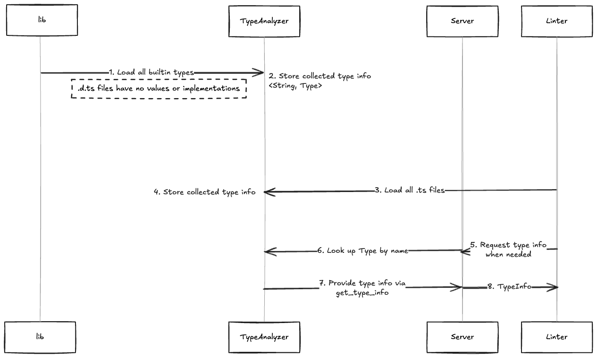

# type_poc_v3

This small PoC only analyzes a subset of built-in .d.ts and .ts files — specifically
- variable declarations
- declared functions
- interface declarations
- type aliases
- ambient declarations
- some simple literals

to explore whether implementing a tool similar to typescript-eslint is feasible.
As a result, the PoC can analyze quite simple cases.

In the samples in this repository, the analyzer loads the built-in file

```typescript
// https://github.com/microsoft/TypeScript/blob/caf1aee269d1660b4d2a8b555c2d602c97cb28d7/src/lib/es5.d.ts#L1512-L1540
interface PromiseLike<T> {
  /**
   * Attaches callbacks for the resolution and/or rejection of the Promise.
   * @param onfulfilled The callback to execute when the Promise is resolved.
   * @param onrejected The callback to execute when the Promise is rejected.
   * @returns A Promise for the completion of which ever callback is executed.
   */
  then<TResult1 = T, TResult2 = never>(
    onfulfilled?:
      | ((value: T) => TResult1 | PromiseLike<TResult1>)
      | undefined
      | null,
    onrejected?:
      | ((reason: any) => TResult2 | PromiseLike<TResult2>)
      | undefined
      | null
  ): PromiseLike<TResult1 | TResult2>;
}

/**
 * Represents the completion of an asynchronous operation
 */
interface Promise<T> {
  /**
   * Attaches callbacks for the resolution and/or rejection of the Promise.
   * @param onfulfilled The callback to execute when the Promise is resolved.
   * @param onrejected The callback to execute when the Promise is rejected.
   * @returns A Promise for the completion of which ever callback is executed.
   */
  then<TResult1 = T, TResult2 = never>(
    onfulfilled?:
      | ((value: T) => TResult1 | PromiseLike<TResult1>)
      | undefined
      | null,
    onrejected?:
      | ((reason: any) => TResult2 | PromiseLike<TResult2>)
      | undefined
      | null
  ): Promise<TResult1 | TResult2>;

  /**
   * Attaches a callback for only the rejection of the Promise.
   * @param onrejected The callback to execute when the Promise is rejected.
   * @returns A Promise for the completion of the callback.
   */
  catch<TResult = never>(
    onrejected?:
      | ((reason: any) => TResult | PromiseLike<TResult>)
      | undefined
      | null
  ): Promise<T | TResult>;
}

```

I added `fake-linter`, a simple linter that checks if promises are used correctly and mimics the `no-floating-promise` rule. This analyzer can report issues in sample code.

```typescript
async function test(): Promise<void> {
  Promise.resolve("value");
  Promise.resolve("value").then(() => {});
  Promise.resolve("value").catch();
  Promise.resolve("value").finally();
}

async function returnPromise(): Promise<string> {
  return "value";
}
// invalid
returnPromise();
returnPromise().then(() => {});
returnPromise().catch();
returnPromise().finally();

//valid
await returnPromise2();
(async () => {
  await returnPromise2();
  await returnPromise2().then(() => {});
  await returnPromise2().catch();
  await returnPromise2().finally();
})();

// invalid
declare const promiseValue: Promise<number>;
async function test4(): Promise<void> {
  promiseValue;
  promiseValue.then(() => {});
  promiseValue.catch();
  //valid
  await promiseValue.finally();
}
test4();

// invalid
declare const promiseOrNumber: Promise<number> | number;

async function test() {
  promiseOrNumber;
}

// invalid
const foo = async (): Promise<void> => {
  Promise.resolve("value");
};
foo();

```

```
// Result
Unhandled Promise at 38..66 => "Promise.resolve(\"value\");"
Unhandled Promise at 66..109 => "Promise.resolve(\"value\").then(() => {});"
Unhandled Promise at 109..145 => "Promise.resolve(\"value\").catch();"
Unhandled Promise at 145..183 => "Promise.resolve(\"value\").finally();"
Unhandled Promise at 256..284 => "returnPromise();"
Unhandled Promise at 284..316 => "returnPromise().then(() => {});"
Unhandled Promise at 316..341 => "returnPromise().catch();"
Unhandled Promise at 341..368 => "returnPromise().finally();"
Unhandled Promise at 656..672 => "promiseValue;"
Unhandled Promise at 672..703 => "promiseValue.then(() => {});"
Unhandled Promise at 703..727 => "promiseValue.catch();"
Unhandled Promise at 771..780 => "test4();"
Unhandled Promise at 874..893 => "promiseOrNumber;"
Unhandled Promise at 948..976 => "Promise.resolve(\"value\");"
Unhandled Promise at 979..986 => "foo();"
```

You can run the PoC with the following command:

```shell
$ cargo run
```

## Supported types
- types
  - number
  - string
  - boolean
  - symbol
  - bigint
  - any
  - unknown
  - never
  - void
- literal
  - string literal
  - number literal
  - boolean literal
  - object literal
- Declaration
  - variable declaration
  - function declaration
  - interface declaration
  - type alias
  - ambient declaration
- union

## How it works



1. Firstly, all the built-in types are loaded. Built-in types are defined in the .d.ts files located under the typescript/lib directory. These files do not contain expressions or implementations with values.
2. The type information collected here is stored in a HashMap of `<String, Type>`.
3. Next, the target files for linting are analyzed to gather type declarations. By collecting type information from all target files in advance, we aim to accurately resolve cross-references and properly handle type merges in the future.
4. The type information collected here is stored in a HashMap of `<PathBuf, <String, Type>>`.
5. When access to type information is required, the get_type_info function is called to obtain type information from the symbol's name.


## Problems and limitations

This PoC is toy. It has a lot of limitations:
- It does not handle scoping.
- Expression type analysis is limited to simple literals.
- Generics resolution is not implemented.
- Type merging is not implemented.
- Symbol lookups rely on simple string matching, which should be improved.

Moreover, the current data structure for the symbol table is very basic (<String, Type>). While this might be acceptable for built-in types, it can lead to conflicts or other issues for user-defined types.

In practice, tools like tsc (and typescript-eslint) parse all target files up front, gather type information, and then resolve references and generics as needed. I think this workflow is necessarily because Built-in types often reference each other for more precise definitions(Promise is a good example.)

Although the PoC can handle references to simple built-in types like Promise, more robust solutions would require:
- Proper scoping
- Generics resolution
- Conditional types
- multifile analysis

For implementing lint rules, it would be beneficial to have a direct way to access type information from `SyntaxNode`. I suspect that leveraging `biome_js_semantic` and improving Symbol table structure could help.


